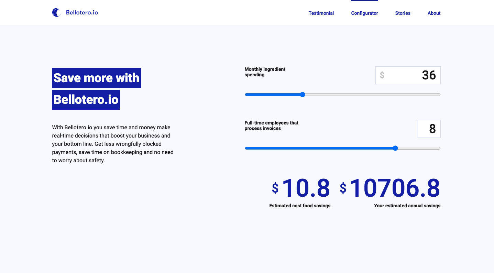

<br />
<p align="center">
  <a href="#" target="_blank">
    
  </a>

  <h3 align="center">Bellotero.io</h3>

  <p align="center">
    website with react and redux
    <br />
    <br />
    <a href="https://objective-blackwell-58cd19.netlify.app/page-1">View Demo</a>
    ·
    <a href="https://github.com/oscarbebop/Bellotero/issues">Report Bug</a>
    ·
    <a href="https://github.com/oscarbebop/Bellotero/issues">Request Feature</a>
  </p>
</p>

## About The Project



Bellotero is a website made with react and redux.

The purpose of this page is only to put these technologies into practice accompanied by a UI.

This page has navigation, global state, calculator and use of an API functionalities.

## Getting Started

## Prerequisites

To run this project it is necessary to have [NodeJS](https://nodejs.org/en/) version 14 or higher installed on your machine.

## Installation

1. Clone the repo
   ```sh
   git clone https://github.com/oscarbebop/Bellotero.git
   ```
2. Install NPM packages
   ```sh
   npm install
   ```
3. Run the project
   ```sh
   npm start
   ```

## Contributing

I would like more people to be able to contribute to the development of this repository or help me integrate more languages.

If you want to contribute you can follow the following steps

1. Fork the Project
2. Create your Feature Branch (`git checkout -b feature/AmazingFeature`)
3. Commit your Changes (`git commit -m 'Add some AmazingFeature'`)
4. Push to the Branch (`git push origin feature/AmazingFeature`)
5. Open a Pull Request

## License

Distributed under the MIT License. See `LICENSE` for more information.

## Contact

If you want to contact me you can do it through these means

Twitter - [@oscarbebop](https://twitter.com/oscarbebop)

Email - hello@castaneda.io

## Acknowledgements

There are many external libraries which helped me a lot in creating this project. In this section I will include all the ones I used.

- [Create React App + typescript - react boilerplate with typescript](https://create-react-app.dev/docs/adding-typescript/)
- [Styled Components - Styles as React components](https://styled-components.com/)
- [redux](https://redux.js.org/)
- [redux-thunk](https://github.com/reduxjs/redux-thunk)
- [react-redux](https://react-redux.js.org/)
- [axios](https://github.com/axios/axios)
